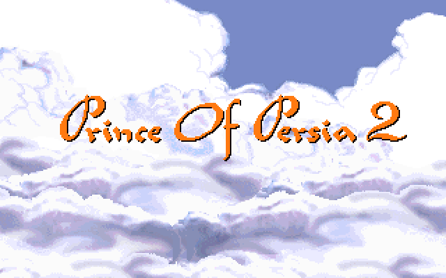
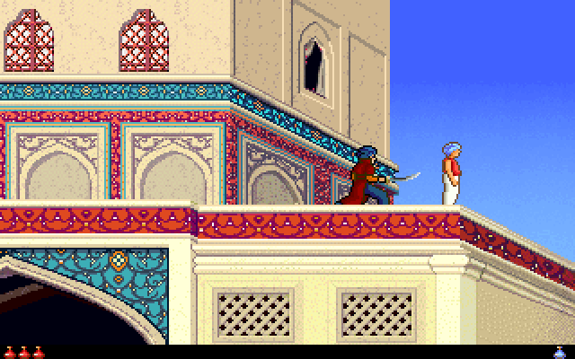
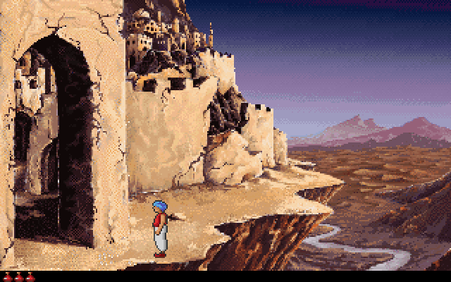
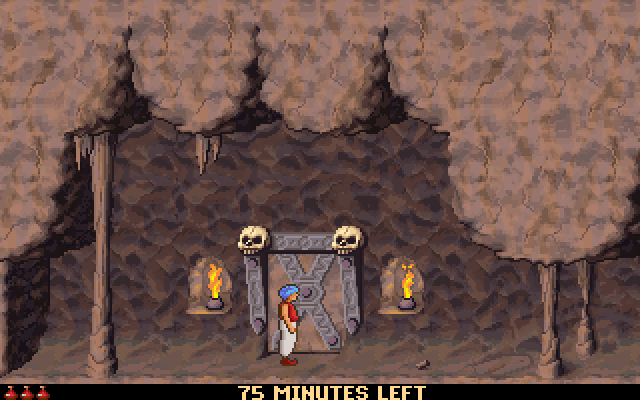
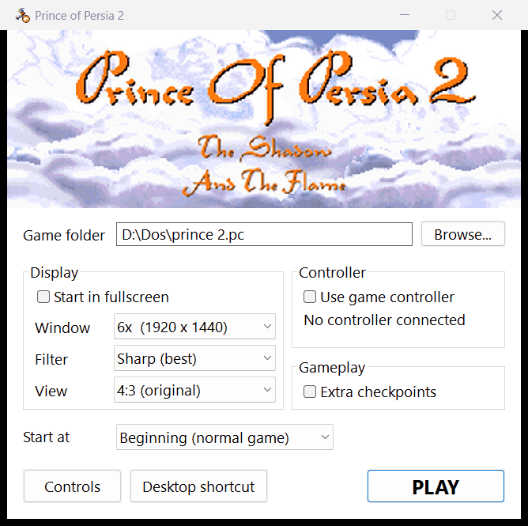

# Prince of Persia 2 - native Windows port

`pop2.exe` is the original DOS `PRINCE.EXE`, statically recompiled to C and linked with a small
Windows runtime.  All game logic, rendering, the intro and the music driver are the original code;
only the PC hardware (VGA, timer, keyboard, Sound Blaster/AdLib) is replaced natively.

This repository holds the recompiler, the Windows runtime and the launcher - no game code, data or
artwork.  Everything derived from the game is generated on your machine from your own copy, so you
need an installed Prince of Persia 2 to build and to play.

## Screenshots

| | |
|---|---|
|  |  |
|  |  |

<p align="center"></p>

## Playing

Run **`PoP2 Launcher.exe`**: choose the game folder, fullscreen / window size, controller on/off,
and optionally a start level; *Desktop shortcut* adds a desktop icon.  Settings are saved in
`pop2.ini`.  `pop2.exe` can also be run directly (game data: `GameDir` from pop2.ini, else next
to the exe, else `D:\Dos\prince 2.pc`).

| Key | Xbox pad | PlayStation pad | Action |
|---|---|---|---|
| Arrow keys | D-pad / left stick | D-pad / left stick | run, jump (up), crouch (down) |
| Up | A | Cross | jump / climb / block |
| Shift | B, RB, RT | Circle, R1, R2 | action: grab ledges, pick up, drink |
| Ctrl | X, LB, LT | Square, L1, L2 | sword strike |
| Down | Y | Triangle | crouch / put sword away |
| Space | Back / View | Create / Share | skip intro / show time left |
| Esc | Start | Options | pause |
| Alt+Enter or F11 | | | fullscreen on/off |
| F7 / F8 | | | cycle display filter / view |

Controllers: Xbox pads through XInput; PlayStation (DualShock / DualSense), Switch and generic USB
pads through the Windows joystick API.

Display (`src/video.c`, OpenGL): filters *Sharp* (sharp-bilinear: crisp, evenly sized pixels at any
size), *Pixel*, *Soft*, *Smooth HQ* (Scale3x edge smoothing); views *4:3*, *Wide* (stretch) and
*Wide panorama* (centre kept at 4:3, stretch grows toward the sides).

Extra checkpoints (optional, off by default - tick it in the launcher or set `Checkpoints=1` in
pop2.ini): out of the box a dead prince goes back to the start of the level, as in the original.
With the option on, the state is snapshotted the first time the kid stands in each new room, and
after dying a key press restores it (the remaining time is kept).

The 75 minute limit behaves as in the original: the clock starts when you reach level 5, Space
shows the time left, and the game announces it every five minutes and every minute near the end.

Cheat mode (the game's own): `pop2.exe MAKINIT` - `pop2.exe MAKINIT LEVEL5` starts at level 5.

## Sound

- Music: when `MIDI.DRV` is the AdLib / Sound Blaster FM driver (as installed here), the
  driver's own code runs recompiled and drives an OPL2 (YM3812) emulator (`src/opl.c`).
  Other MIDI drivers fall back to the Windows General MIDI synth.
- Effects: `DIGI.DRV` sample playback is replaced by waveOut.

## Building

You need your own copy of the game: the recompiled C sources (`src/gen`) and the icons are not in
this repository, they are produced locally from the files you already own.  Requirements: clang /
llvm-rc (LLVM for Windows) and Python 3.

```
export POP2_GAMEDIR="D:/Dos/prince 2.pc"     # folder with PRINCE.EXE and the .DAT files
python recomp/recomp.py recomp/extra_entries.txt   # -> src/gen/*.c  (a few minutes)
python res/make_art.py                        # optional: icons from the game's prince.ico
./build.sh                                    # clang -> pop2.exe and PoP2 Launcher.exe
```

`build_dbg.sh` makes `pop2_dbg.exe` with the stack/frame checks and memory watchpoints enabled.

Coverage tools: `iterate.sh` / `levels.sh` run the game with scripted keys and add any
code entry points hit at runtime that were not yet recompiled; `recomp/scan_prologues.py`
finds function pointers statically.  Debug env vars: `POP2_KEYS`, `POP2_SHOTS`,
`POP2_WATCH`, `POP2_FMWAV`, `POP2_SNDLOG`.
